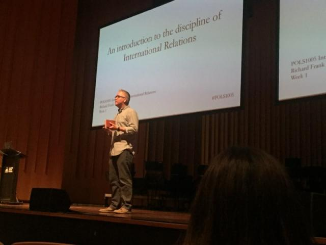

From 2015 to 2018, I taught this large first-year course in International Relations. I co-taught three times and taught it in 2017 on my own.

This class provides a broad introduction to the study of international relations. As a field of study, international relations focuses on the political, military, economic, and cultural interaction of state and non-state actors at the global level. The field therefore encompasses a diverse array of topics, from the causes of war to the politics of development, from international institutions to the environment. In this course, we begin by exploring the key concepts, foundational events, issues, and processes of international relations, and we provide the general knowledge and analytic tools necessary to understand, evaluate, and respond to a complex array of problems in the contemporary world.

[Syllabus](https://richardwfrank.com/wp-content/uploads/2021/08/pols1005-2017-course-guide-v3.pdf)

[Teaching handbook](https://richardwfrank.com/wp-content/uploads/2021/08/pols1005-2017-teaching-handbook.pdf)

[Response paper guide](https://richardwfrank.com/wp-content/uploads/2021/08/pols1005-response-paper-guide.pdf)

[Tutor response paper guide](https://richardwfrank.com/wp-content/uploads/2021/08/pols1005-response-paper-tutors-guide.pdf)

[Syria simulation guide](https://richardwfrank.com/wp-content/uploads/2021/08/2017-pols1005-syrian-conflict-simulation.pdf)

[Class analysis](https://richardwfrank.com/wp-content/uploads/2021/08/pols1005-2017-class-analysis.pdf)

| **Week** | **Topic** | **Slides** |
| --- | --- | --- |
| **Part 1** | **Foundations** |  |
| 1 | Introduction | [pdf](https://www.dropbox.com/s/oktvsza8ljrxizj/Lecture%201.pdf?dl=0) [pptx](https://www.dropbox.com/s/0vv5f1q25et5l1k/Lecture%201.pptx?dl=0) |
| 2 | IR theories | [pdf](https://www.dropbox.com/s/t934x2sws7jmc4r/Lecture%202.pdf?dl=0) [pptx](https://www.dropbox.com/s/r30w3bt6wh9ur5z/Lecture%202.pptx?dl=0) |
| **Part 2** | **War and peace** |  |
| 3 | Why do wars occur? | [pdf](https://www.dropbox.com/s/xdcmwh2oymr9o2w/Lecture%203.pdf?dl=0) [pptx](https://www.dropbox.com/s/2w7jtdza48df1bl/Lecture%203.pptx?dl=0) |
| 4 | Domestic politics and war | [pdf](https://www.dropbox.com/s/mvd8rpso5ysnn0q/Lecture%204.pdf?dl=0) [pptx](https://www.dropbox.com/s/df8cy6jk2jvjjdy/Lecture%204.pptx?dl=0) |
| 5 | International institutions and war | [pdf](https://www.dropbox.com/s/hszo9lsxx2uk1xs/Lecture%205.pdf?dl=0) [pptx](https://www.dropbox.com/s/34hzcme6i29fnkk/Lecture%205.pptx?dl=0) |
| 6 | Violence by non-state actors | [pdf](https://www.dropbox.com/s/oonzip50f6bl51u/Lecture%206.pdf?dl=0) [pptx](https://www.dropbox.com/s/6tnlknwynosf2qg/Lecture%206.pptx?dl=0) |
| **Part 3** | **International political economy** |  |
| 7 | The politics of trade and finance | [pdf](https://www.dropbox.com/s/ubvtefb1rk83e4x/Lecture%207.pdf?dl=0) [pptx](https://www.dropbox.com/s/e8zolzb0i9kj7c3/Lecture%207.pptx?dl=0) |
| 8 | Economic and political development | [pdf](https://www.dropbox.com/s/fjy6ifft0pyjyu3/Lecture%208.pdf?dl=0) [pptx](https://www.dropbox.com/s/i8m5fmye2b2vcww/Lecture%208.pptx?dl=0) |
| **Part 4** | **Specific international actors** |  |
| 9 | International law | [pdf](https://www.dropbox.com/s/143wujfktr97c0i/Lecture%209.pdf?dl=0) [pptx](https://www.dropbox.com/s/3sa5cseoz8jop19/Lecture%209.pptx?dl=0) |
| 10 | Human rights and refugees | [pdf](https://www.dropbox.com/s/34o2q61f6xxuk9s/Lecture%2010.pdf?dl=0) [pptx](https://www.dropbox.com/s/prgf9byhk4uve1n/Lecture%2010.pptx?dl=0) |
| 11 | The global environment | [pdf](https://www.dropbox.com/s/qxd6ki1djug1827/Lecture%2011.pdf?dl=0) [pptx](https://www.dropbox.com/s/a2g7luspyin8wrb/Lecture%2011.pptx?dl=0) |
| 12 | Conclusions and future directions | [pdf](https://www.dropbox.com/s/y6jsg5y3fe0aa9i/Lecture%2012.pdf?dl=0) [pptx](https://www.dropbox.com/s/w60353v1mxs2i49/Lecture%2012.pptx?dl=0) |
