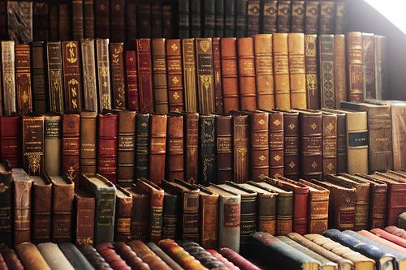
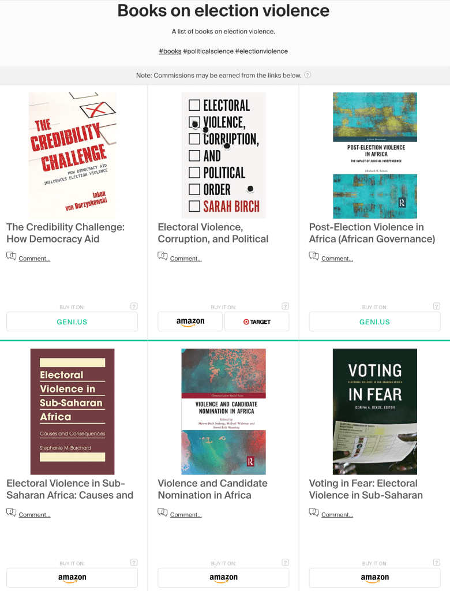
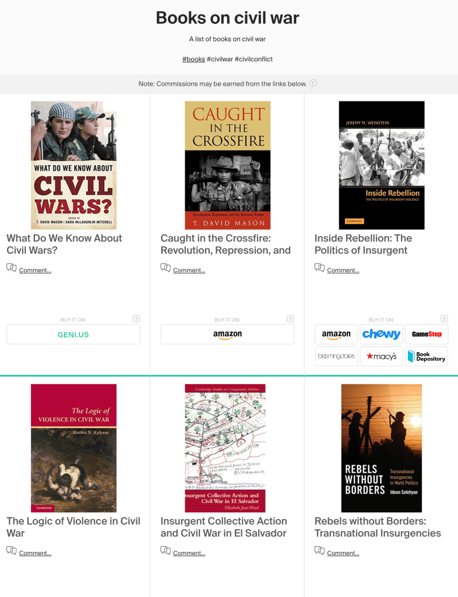
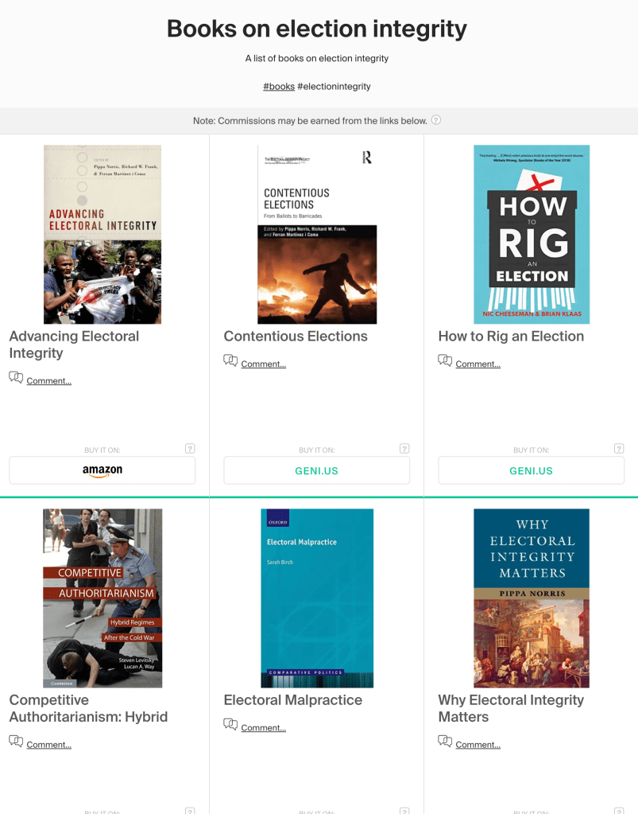
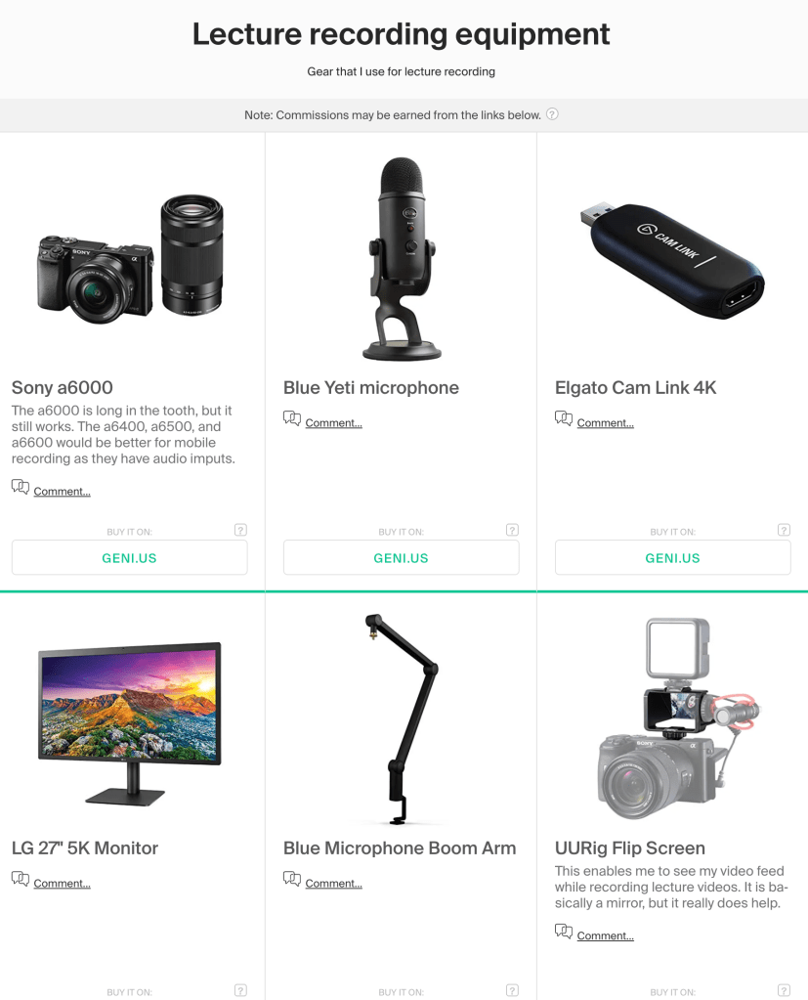
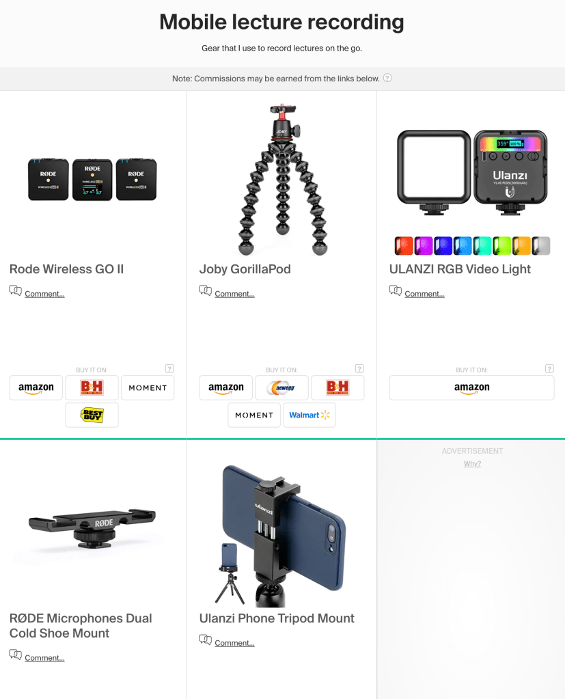

[My teaching resources](https://richardwfrank.com/teaching/teaching-resources/)

Below are some lists of books and gear I use regularly for my research and teaching. Let me know if you think I missed anything cool/interesting!

[A list of interesting books on election violence](https://kit.co/richwfrank/books-on-election-violence)

[A list of interesting books on civil war](https://kit.co/richwfrank/books-on-civil-war)

[A list of interesting books on election integrity](https://kit.co/richwfrank/books-on-election-integrity)

[Gear I use for lecture recording](https://kit.co/richwfrank/lecture-recording-equipment)

[Gear I use for mobile lecture recording](https://kit.co/richwfrank/mobile-lecture-recording)
