Have you ever wondered why some elections have higher voter turnout than others?

If you have, my new (open source) [Political Behavior](https://www.springer.com/journal/11109) [article](https://link.springer.com/article/10.1007/s11109-021-09720-y) with [Ferran Martínez i Coma](https://www.griffith.edu.au/griffith-business-school/departments/government-international-relations/contact-us/fernando-martinez-i-coma) might be of interest.

[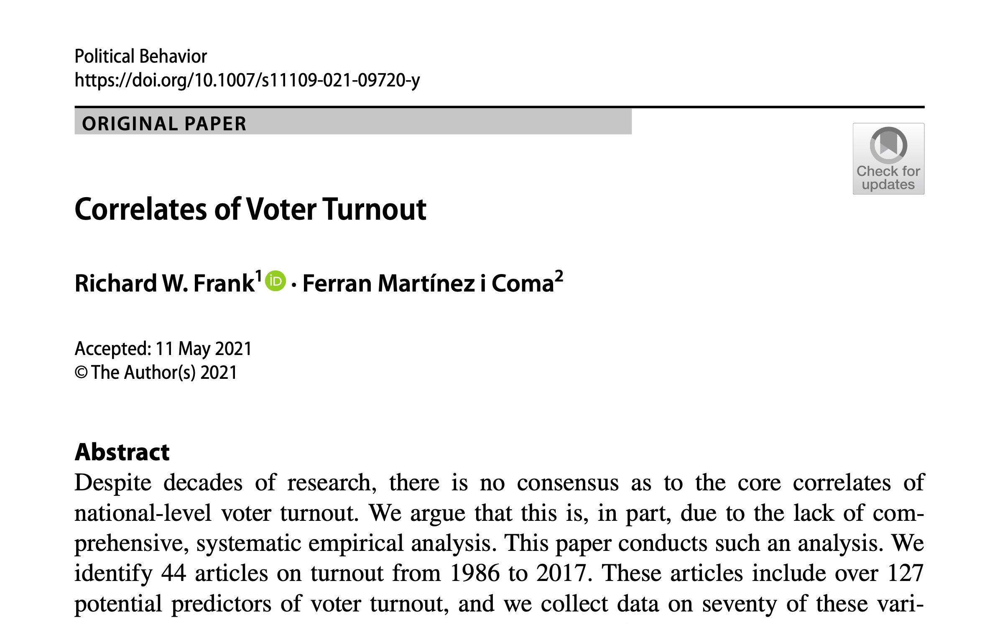](https://richardwfrank.com/wp-content/uploads/2021/06/voter-turnout-first-page.jpeg)

How \*and why\* did we read over 300 turnout articles, extract 127 unique explanatory variables from them, collect data on 70 factors, and then run over 15 million regressions?

A very good question…one I asked myself a few times over the last few years.

This project began shortly after Ferran and I finished an [article](https://doi.org/10.1016/j.electstud.2017.05.007) looking at how election dynamics shaped experts perceptions of electoral integrity.

For that article I played around with extreme bounds analysis (EBA) as a robustness check of our main models. We ran 164,220 additional regressions to see whether our results were sensitive to different model specifications. Nope, our main IVs remained robustly significant.

Now EBA is not a new method. Leamer (1985) proposed it as a form of organized sensitivity analysis to see whether a coefficient is robust to the inclusion of other explanatory variables.

[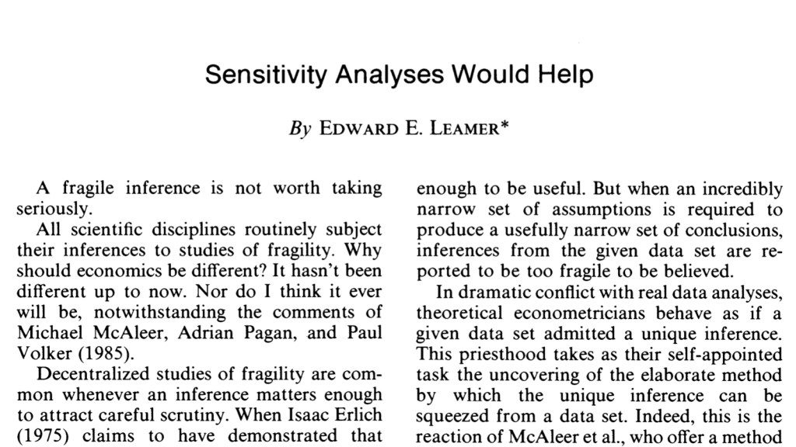](https://richardwfrank.com/wp-content/uploads/2021/06/leamer-1985.jpeg)

A decade or so later, [Sala-i-Martin (1997)](https://www.jstor.org/stable/2950909) suggested that Leamer’s extreme bounds threshold for robustness was overly strict and proposed a version of model averaging where we look at the entire distribution of betas instead of just the extreme values.

[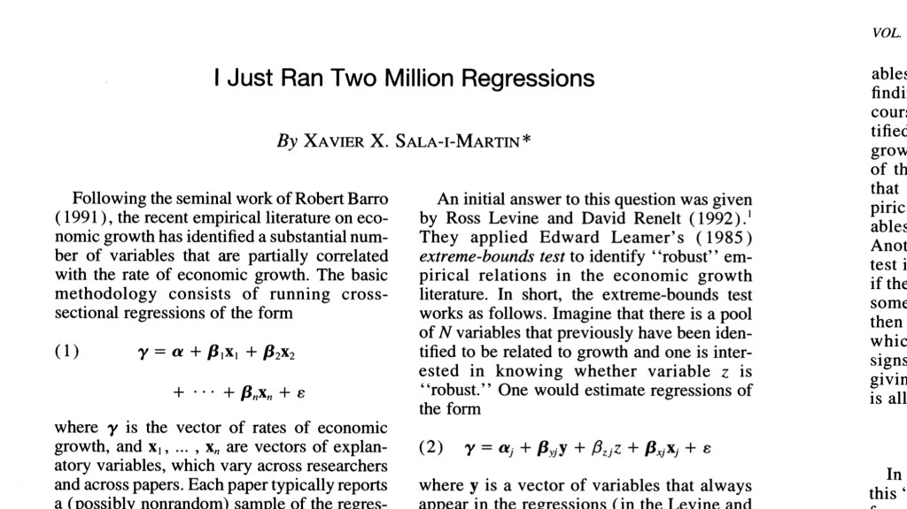](https://richardwfrank.com/wp-content/uploads/2021/06/sala-i-martin.jpeg)

[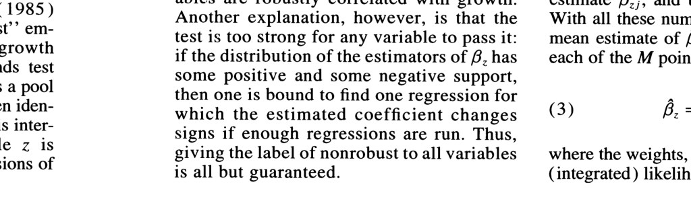](https://richardwfrank.com/wp-content/uploads/2021/06/s-i-m-2.jpeg)

[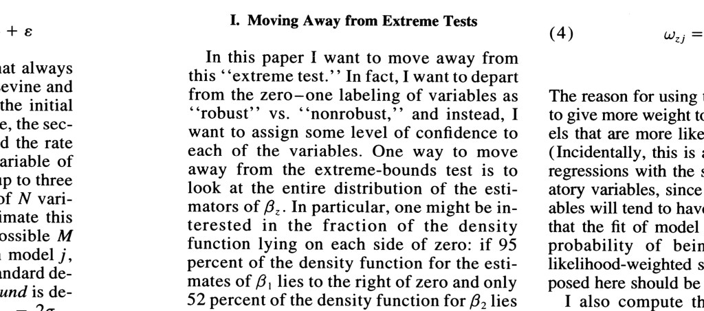](https://richardwfrank.com/wp-content/uploads/2021/06/s-i-m-3.jpeg)

In the two decades since Sala-i-Martin (1997) and Levine and Renelt’s (1992) EBA studies of economic growth, the method has been used to evaluate the correlates of human rights violations (Hafner-Burton 2005), democracy (Gassebner et al. 2013), life expectancy and infant mortality (Carmignani et al. 2014), health care expenditures (Hartwig & Sturm 2014), human trafficking (Cho 2015), coups (Miller et al. 2018), amongst many others.

Therefore, we thought it would be interesting to use EBA again, this time at the heart of our research design. But what variables should we include in our models?

To make our list, [@fmartinezicoma](https://twitter.com/fmartinezicoma) read over 300 turnout articles and chose 44 comparative turnout students that met our decision criteria.

These articles included 127 unique variables as either independent or control variables. We grouped these variables into three main types—institutional, political, and socioeconomic.

[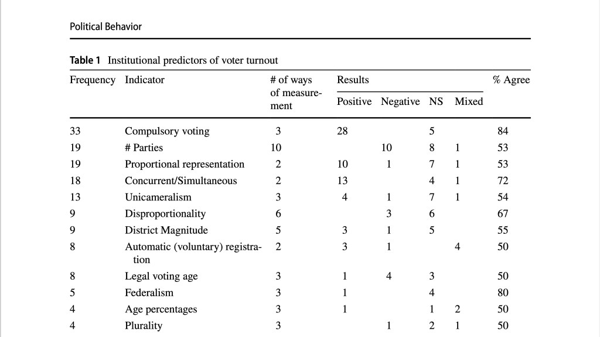](https://richardwfrank.com/wp-content/uploads/2021/06/institutions.jpeg)

[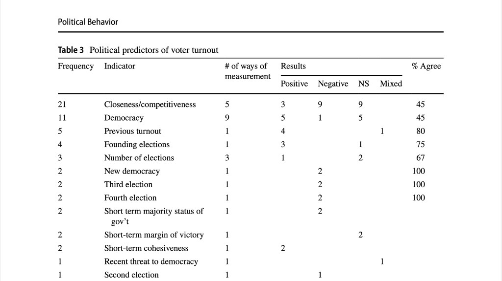](https://richardwfrank.com/wp-content/uploads/2021/06/political.jpeg)

[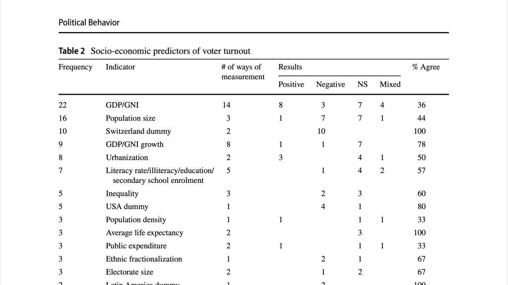](https://richardwfrank.com/wp-content/uploads/2021/06/socioecon.jpeg)

During this process, several trends emerged.

(1) Less than half (44%) of the 127 variables appear in more than one study.

(2) Among the 55 variables that appear in more than one article, over half (57%) were measured in more than one way.

(3) While voting is (of course) a profoundly political act, the most common empirically tested arguments in the literature are of institutional or socio-economic mechanisms.

[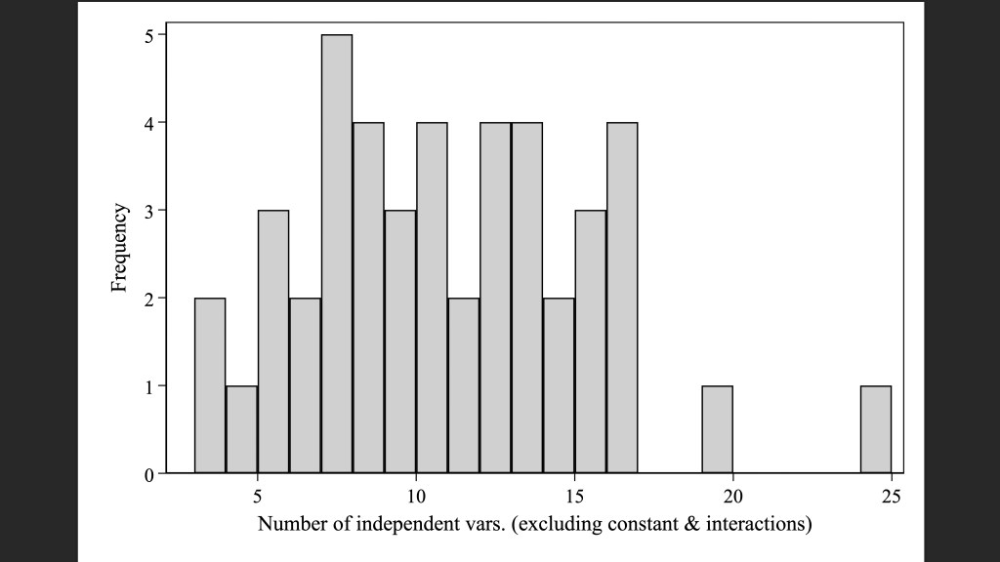](https://richardwfrank.com/wp-content/uploads/2021/06/number-of-ivs.jpeg)

It is clear that even with similar research questions (“what drives turnout?”) and the same [International IDEA](https://twitter.com/int_idea) turnout data, researchers estimated wildly different models.

This is not unique to political science of course. The most dramatic example of this I’ve come across is [Siberzahn et al.’s (2018) article “Many Analysts, One Dataset”](https://journals.sagepub.com/doi/10.1177/2515245917747646) where 29 teams of 61 analysts all use the same dataset to estimate soccer referees’ use of red cards.

[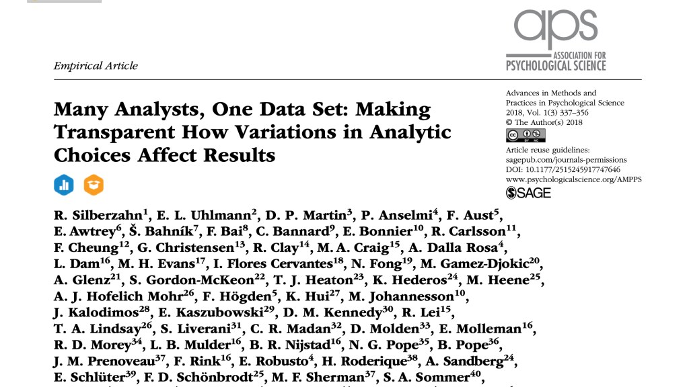](https://richardwfrank.com/wp-content/uploads/2021/06/many-analysts-one-dataset.jpeg)

Anyways, I set to work tracking down as many of these variables as possible. In the end, we used 70 national-level predictors of voter turnout. Including all 127 predictors discussed above in our empirical models was not possible due to data availability—several variables are available for only a short span of time, specific region (i.e., Europe) or a clear set of countries (i.e., OECD members).

We included five of the most common predictors in every model (lagged turnout, compulsory voting, proportional representation, per capita income, and population).

We then used different combinations of the other 65 variables in sets of three.

Our sample was 579 parliamentary elections in 80 countries, 1945-2014.

We (and the reviewers) realized that this first set of EBA models was not the end, but the beginning of our sensitivity research.

Indeed, [Plümper and Traunmüller’s (2020)](https://www.cambridge.org/core/journals/political-science-research-and-methods/article/abs/sensitivity-of-sensitivity-analysis/525549A1703E35C685F748F73748926C) recent Monte Carlo study of these and other sensitivity tests demonstrates how there is no definition of “robustness” that completely avoids false negatives and false positives.

[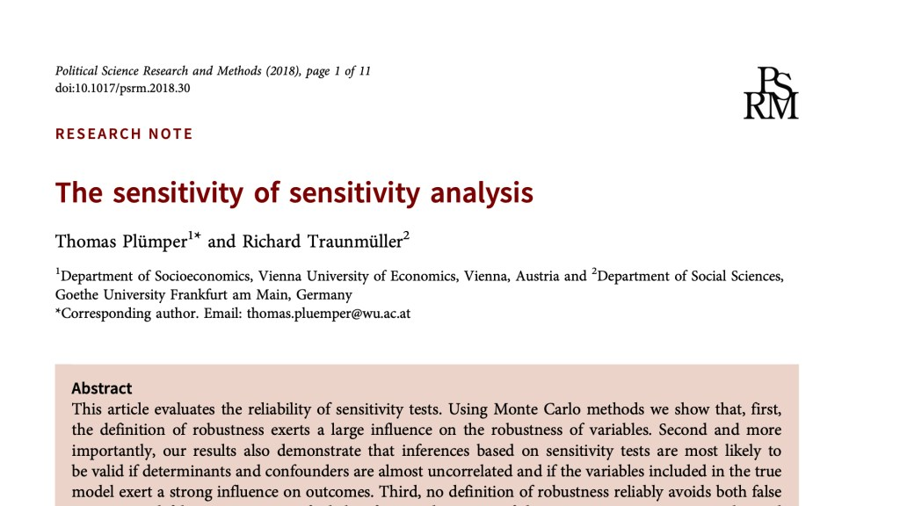](https://richardwfrank.com/wp-content/uploads/2021/06/plucc88mper-and-traunmucc88ller.jpeg)

Therefore, we ran a series of models using fixed and random effects, different dependent variables, and different samples. All in all, we ran sixteen different sets of models.

[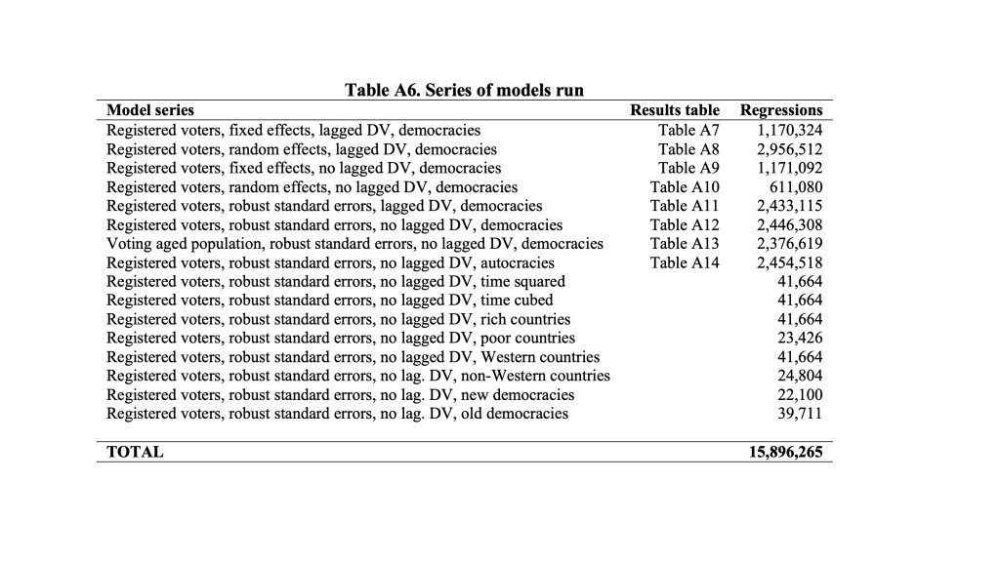](https://richardwfrank.com/wp-content/uploads/2021/06/series-of-models.jpeg)

Overall, we found that 22 variables are robustly associated with voter turnout, including compulsory voting, concurrent elections, competitive elections, inflation, previous turnout, and economic globalization.

[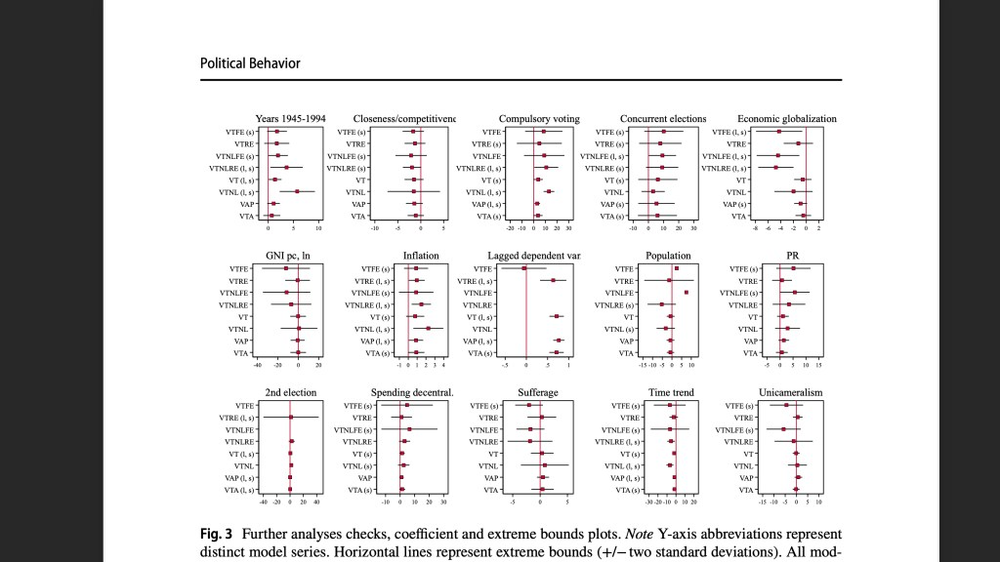](https://richardwfrank.com/wp-content/uploads/2021/06/lots-of-coefplots.jpeg)

I think our article provides some suggestive answers to our research question—what drives national-level voter turnout?

Of course, trying to answer one question leads to a host of others…

(1) Do different operationalizations of the same concept lead to different conclusions?

(2) Would theoretically informed interaction terms also make the grade?

(3) Plümper and Traunmüller (2018) find that Bayesian model averaging’s (BMA) definition minimizes false positives. Would a BMA of voter turnout lead to different results?

Anyways, I hope this article is of use to both (1) people interested in voter turnout and (2) all of us interested in making sure our results are not sensitive to different model specifications.

The [paper](https://link.springer.com/article/10.1007/s11109-021-09720-y) is open-source and is online now although it is not likely to actually get in an issue for a few years. The replication files are also available now at my [Dataverse](https://dataverse.harvard.edu/dataverse/richardwfrank)[.](https://dataverse.harvard.edu/dataverse/richardwfrank)
